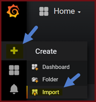
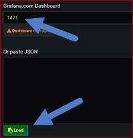
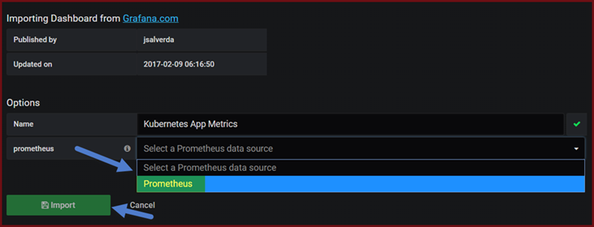

# References

https://github.com/kubernetes/charts/tree/master/stable/prometheus
https://github.com/timfpark/k8s-prom-grafana/blob/master/prometheus/deploy

# Pre-requisites for Kubernetes Cluster

- RBAC enabled (so no AKS until it is GA)
- Network Policy enabled CNI installed (Calico for now, Azure CNI does not support network policy yet)
- Prometheus and Grafana will not be publically exposed
- cAdvisor must be installed to get container metrics - this will be installed manually for now.
- Helm installed

# Kubernetes Cluster Setup

```
kubectl create namespace monitor
```

# Install cAdvisor ?

```
kubectl apply -f cadvisor_daemonset.yaml --namespace monitor
```

# Install Prometheus

```
helm install --name prometheus stable/prometheus --version 6.2.1 --namespace monitor \
  --set alertmanager.persistentVolume.storageClass=managed-premium \
  --set alertmanager.persistentVolume.size=128Gi \
  --set server.persistentVolume.storageClass=managed-premium \
  --set server.persistentVolume.size=128Gi \
  --set networkPolicy.enabled=true
```

Output 

```
NAME:   prometheus
LAST DEPLOYED: Thu Apr 26 18:00:21 2018
NAMESPACE: monitor
STATUS: DEPLOYED

RESOURCES:
==> v1/ConfigMap
NAME                     DATA  AGE
prometheus-alertmanager  1     2s
prometheus-server        3     2s

==> v1/PersistentVolumeClaim
NAME                     STATUS   VOLUME           CAPACITY  ACCESS MODES  STORAGECLASS  AGE
prometheus-alertmanager  Pending  managed-premium  2s
prometheus-server        Pending  managed-premium  2s

==> v1/ServiceAccount
NAME                           SECRETS  AGE
prometheus-alertmanager        1        2s
prometheus-kube-state-metrics  1        2s
prometheus-node-exporter       1        2s
prometheus-pushgateway         1        2s
prometheus-server              1        2s

==> v1beta1/ClusterRole
NAME                           AGE
prometheus-kube-state-metrics  2s
prometheus-server              2s

==> v1beta1/ClusterRoleBinding
NAME                           AGE
prometheus-kube-state-metrics  2s
prometheus-server              2s

==> v1beta1/DaemonSet
NAME                      DESIRED  CURRENT  READY  UP-TO-DATE  AVAILABLE  NODE SELECTOR  AGE
prometheus-node-exporter  3        3        0      3           0          <none>         2s

==> v1/NetworkPolicy
NAME                           POD-SELECTOR                                                    AGE
prometheus-alertmanager        app=prometheus,component=alertmanager,release=prometheus        2s
prometheus-kube-state-metrics  app=prometheus,component=kube-state-metrics,release=prometheus  2s
prometheus-server              app=prometheus,component=server,release=prometheus              2s

==> v1/Pod(related)
NAME                                            READY  STATUS             RESTARTS  AGE
prometheus-node-exporter-g68bx                  0/1    ContainerCreating  0         2s
prometheus-node-exporter-kjgmt                  0/1    ContainerCreating  0         2s
prometheus-node-exporter-tfbxb                  0/1    ContainerCreating  0         2s
prometheus-alertmanager-85d944f874-g4vlq        0/2    Pending            0         2s
prometheus-kube-state-metrics-786b6cbc77-6khn9  0/1    ContainerCreating  0         2s
prometheus-pushgateway-585bdfdcd5-h6hlw         0/1    ContainerCreating  0         2s
prometheus-server-6966b574d7-fqkvd              0/2    Pending            0         2s

==> v1/Service
NAME                           TYPE       CLUSTER-IP    EXTERNAL-IP  PORT(S)   AGE
prometheus-alertmanager        ClusterIP  10.0.215.150  <none>       80/TCP    2s
prometheus-kube-state-metrics  ClusterIP  10.0.37.29    <none>       80/TCP    2s
prometheus-node-exporter       ClusterIP  10.0.106.5    <none>       9100/TCP  2s
prometheus-pushgateway         ClusterIP  10.0.116.174  <none>       9091/TCP  2s
prometheus-server              ClusterIP  10.0.16.237   <none>       80/TCP    2s

==> v1beta1/Deployment
NAME                           DESIRED  CURRENT  UP-TO-DATE  AVAILABLE  AGE
prometheus-alertmanager        1        1        1           0          2s
prometheus-kube-state-metrics  1        1        1           0          2s
prometheus-pushgateway         1        1        1           0          2s
prometheus-server              1        1        1           0          2s


NOTES:
The Prometheus server can be accessed via port 80 on the following DNS name from within your cluster:
prometheus-server.monitor.svc.cluster.local


Get the Prometheus server URL by running these commands in the same shell:
  export POD_NAME=$(kubectl get pods --namespace monitor -l "app=prometheus,component=server" -o jsonpath="{.items[0].metadata.name}")
  kubectl --namespace monitor port-forward $POD_NAME 9090


The Prometheus alertmanager can be accessed via port 80 on the following DNS name from within your cluster:
prometheus-alertmanager.monitor.svc.cluster.local


Get the Alertmanager URL by running these commands in the same shell:
  export POD_NAME=$(kubectl get pods --namespace monitor -l "app=prometheus,component=alertmanager" -o jsonpath="{.items[0].metadata.name}")
  kubectl --namespace monitor port-forward $POD_NAME 9093


The Prometheus PushGateway can be accessed via port 9091 on the following DNS name from within your cluster:
prometheus-pushgateway.monitor.svc.cluster.local


Get the PushGateway URL by running these commands in the same shell:
  export POD_NAME=$(kubectl get pods --namespace monitor -l "app=prometheus,component=pushgateway" -o jsonpath="{.items[0].metadata.name}")
  kubectl --namespace monitor port-forward $POD_NAME 9091

For more information on running Prometheus, visit:
https://prometheus.io/
```

# Install Grafana

TODO:  Correct Helm docs for Grafana

1. Value param

   persistence.StorageClass
   should be:
   persistence.StorageClassName

2. Output help

   export POD_NAME=$(kubectl get pods --namespace monitor -l "app=grafana,component=" -o jsonpath="{.items[0].metadata.name}")
   should be:
   export POD_NAME=$(kubectl get pods --namespace monitor -l "app=grafana" -o jsonpath="{.items[0].metadata.name}")


```
helm install --name grafana stable/grafana --version 1.2.0 --namespace monitor \
  --set persistence.enabled=true \
  --set persistence.storageClassName=managed-premium \
  --set persistence.size=128Gi \
  --set persistence.accessModes={ReadWriteOnce} \
  --set adminUser=grafana \
  --set adminPassword=XqKgKjNMn7Au
```

Output

```
NAME:   grafana
LAST DEPLOYED: Thu Apr 26 18:15:53 2018
NAMESPACE: monitor
STATUS: DEPLOYED

RESOURCES:
==> v1/Secret
NAME     TYPE    DATA  AGE
grafana  Opaque  2     0s

==> v1/ConfigMap
NAME                     DATA  AGE
grafana                  1     0s
grafana-dashboards-json  0     0s

==> v1/PersistentVolumeClaim
NAME     STATUS   VOLUME           CAPACITY  ACCESS MODES  STORAGECLASS  AGE
grafana  Pending  managed-premium  0s

==> v1/Service
NAME     TYPE       CLUSTER-IP  EXTERNAL-IP  PORT(S)  AGE
grafana  ClusterIP  10.0.8.148  <none>       80/TCP   1s

==> v1beta2/Deployment
NAME     DESIRED  CURRENT  UP-TO-DATE  AVAILABLE  AGE
grafana  1        1        1           0          1s

==> v1/Pod(related)
NAME                      READY  STATUS   RESTARTS  AGE
grafana-76bc4cb994-pp9p4  0/1    Pending  0         1s


NOTES:
1. Get your 'grafana' user password by running:

   kubectl get secret --namespace monitor grafana -o jsonpath="{.data.admin-password}" | base64 --decode ; echo

2. The Grafana server can be accessed via port 80 on the following DNS name from within your cluster:

   grafana.monitor.svc.cluster.local

   Get the Grafana URL to visit by running these commands in the same shell:

     export POD_NAME=$(kubectl get pods --namespace monitor -l "app=grafana" -o jsonpath="{.items[0].metadata.name}")
     kubectl --namespace monitor port-forward $POD_NAME 3000

3. Login with the password from step 1 and the username: grafana
```

# Configure Grafana for Prometheus

## Add Data Source

## Import Dashboard

You can create your own dashboard or import an existing dashboard. To import an existing dashboard from Grafana:
1. Go to https://grafana.com/dashboards
2. Find the dashboard you would like to use

   a. In our example, we will use https://grafana.com/dashboards/1471
1. Log into Grafana console
2. Click on the Plus sign on left side of dashboard and then click Import.

   

5. Enter the dashboard number and click Load

   

6. Select the database source and click Import

   
